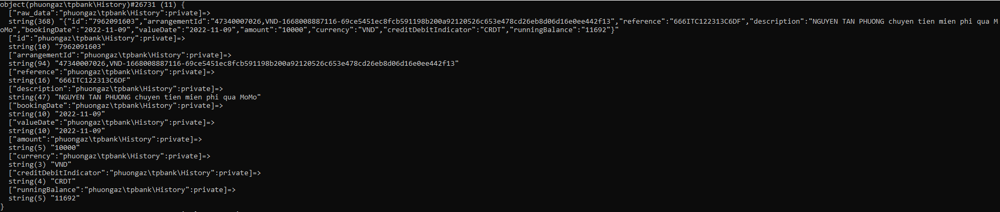

# TPBank API for Pocketmine

Library used to check TPBank transaction history for Pocketmine-MP

```php

public function onEnable() :void{
    $api = new phuongaz\tpbank\API('account_number', 'account', 'password');
    $api->runTask(5); // 5 tick
}

```

Event
```php
    public function onBank(\phuongaz\tpbank\TPBankEvent $event) :void{
        /** @var \phuongaz\tpbank\History */
        $history = $event->getHistory();
    }
```


